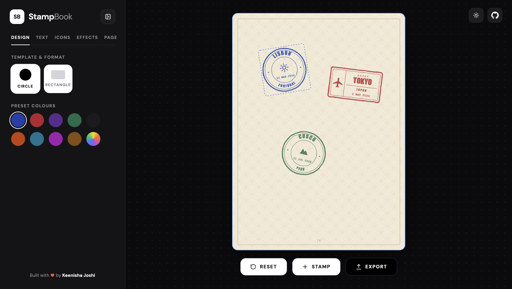

# travel stamp generator :)

Pick a place, a date and an icon, and get an ink stamp like the ones in a passport.
Make a few, drop them on a passport page, and export the whole thing.

Live demo: https://travel-stampbook.vercel.app

## why i made this

I like the look of old passport stamps, and I wanted to see if I could make that
slightly uneven, inky feel with just code. It also fits with Rang Rasta, since a
Jaipur stamp is the obvious first one to make.

## what it does

~ makes a round or rectangular stamp from a place name, a date and an icon\
~ adds ink texture and a slight tilt so it doesn't look too perfect\
~ lets you pick the ink colour, how worn the ink looks, and the size and tilt of each stamp\
~ lets you place several stamps on a passport page and drag them around\
~ switches the paper colour and the page pattern\
~ exports the page as a PNG

## built with

React, Vite, Tailwind CSS and Zustand. The stamps and the passport page are plain SVG:
the text on a curve uses `textPath`, and the ink effect comes from SVG `feTurbulence`
filters. The PNG export draws that SVG onto a canvas. No backend.

## what's not finished

~ only 6 icons and 2 stamp shapes so far\
~ the passport is a single page, and there is no undo\
~ nothing is saved, so a refresh puts the page back to the starter stamps\
~ stamp text uses system fonts (like Impact), so it looks a bit different on each device

## next on my list

~ link it to Rang Rasta so visiting a place gives you its stamp\
~ more stamp shapes and icons\
~ save the passport page so it is still there when you come back\
~ multi-page passports

## run it yourself

    git clone https://github.com/ineek808/stamp-book.git
    cd stamp-book
    npm install
    npm run dev

Then open http://localhost:5173 in your browser. To make a production build, run `npm run build`.

See `WORKFLOW.md` for the folder structure and how the pieces fit together.

## license

MIT. See [LICENSE](./LICENSE).
